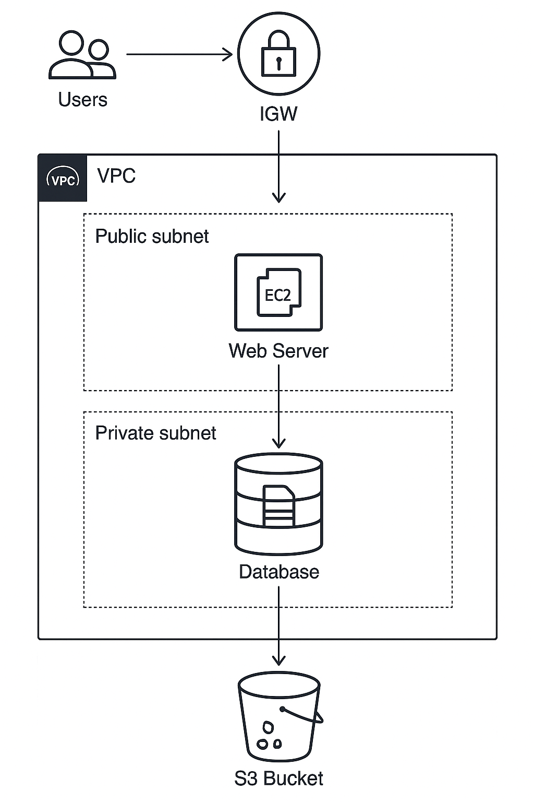
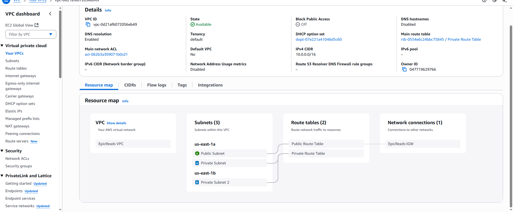
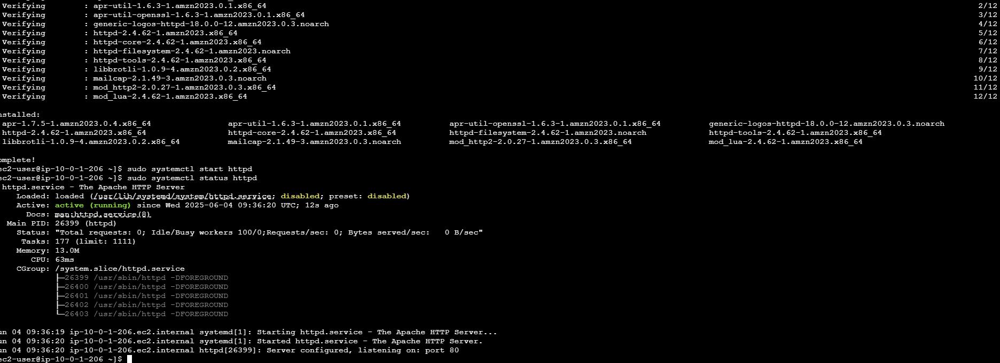
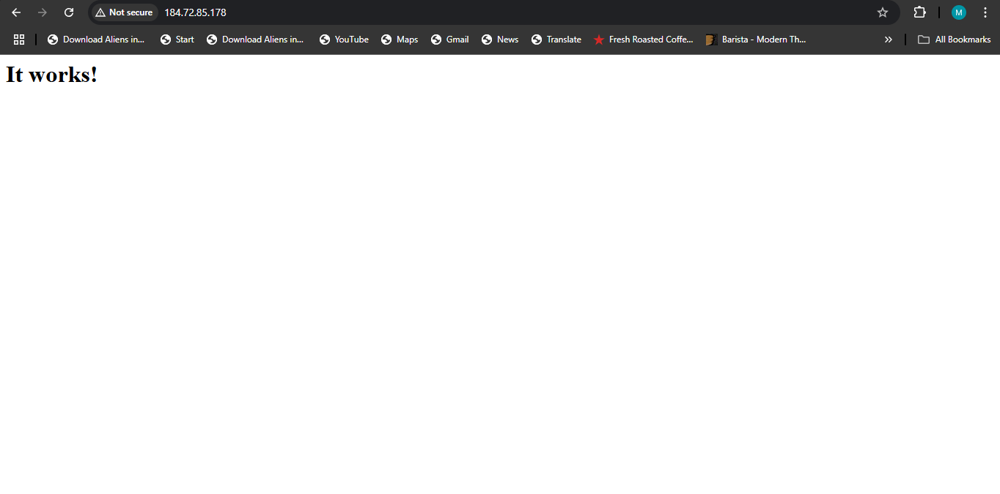
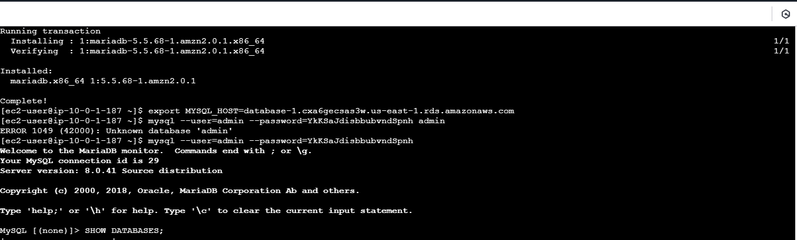

# AWS Two Tier Application

## **Project Overview**

This Project is a robust **Two Tier Application built on AWS** this application is aimed to improve scalability, performance, and security. This project will involve creating a secure network environment, establishing a web application layer, configuring a database layer, and utilizing S3 for static content, all within the AWS cloud.

## **Architecture**




The system is divided into multiple components, each handling a specific function. Below is an overview of the architecture:

```
/Project Folders
│
├── README.md
├── images
│
├── scripts/
│   ├── install apache
│   ├── connect to database
│   └── s3-policy.json
```

### **Key AWS Services Used**

- **VPC** – Isolated network for our infrastructure, consisting of a private and public subnet.
- **EC2** – host the web application tier.
- **Security Groups**	Access control.
- **Amazon RDS(MySQL)** – Serves as a database for the web application.
- **Amazon S3** – host and serve static assets for the application.
- **IAM** – Permissions for EC2 to access S3


## **Deployment Instructions**


### **1. Setting Up VPC**

1. Create a VPC
   Name: Your-VPC-Name
   CIDR block: 10.0.0.0/16
   **Note:** CIDR block size should be between /16 and /28.

2. Create Subnets
   **Public Subnet**
   Name: Public-Subnet-A
   CIDR: 10.0.1.0/24
   Availability Zone: us-east-1a

   **Private Subnet**
   Name: Private-Subnet-A
   CIDR: 10.0.2.0/24
   Availability Zone: us-east-1a

   note: subnets can be created in any availability zone, prefereably create in multiple availability zones.

3. Create Internet Gateway
   Attach to your VPC

4. Create Route Table
   Private and Public Route table
   Private route table leave local route to avoid access to the internet, associtate to private subnets
   Public route table add route 0.0.0.0/0 → Internet Gateway - your internet gateway.




### **2. Security Groups**

1. Web Server SG (for EC2)
   Name: WebServerSG
   Inbound rules:
   HTTP (80) from 0.0.0.0/0
   SSH (22) from your IP only
   Outbound: Allow all

2. Database SG (for RDS)
   Name: DatabaseSG
   Inbound:
   MySQL/Aurora (3306) from WebServerSG
   Outbound: Allow all


### **3. Launch EC2 Instance (Web Server)**

1. Launch Instance
   Amazon Linux 2 AMI
   t2.micro
   Public subnet
   Security group: WebServerSG
   Key pair: Create or select one

2. Connect to EC2 from AWS console

3. Install Apache and test
   apache installation
   sudo yum update
   sudo yum install httpd -y
   sudo systemctl start httpd
   sudo systemctl status httpd
4. test apache installation with your public ip
   http://EC2_Public_IP


### **4. Create RDS MySQL Database**

1. Create Subnet Group and attach subnets from your vpc

2. Launch RDS
   Engine: MySQL

   DB instance class: db.t3.micro (Free Tier eligible)

   Public access: No

   Subnet group: Choose the subnet group created with your vpc

   Security group: DatabaseSG

3. NoteDown these details after Database creation
   Endpoint

   Port

   Username & password
4. Connect EC2 to RDS
   mysql -h <RDS-endpoint> -u <username> -p


### **5. S3 Bucket for Static Assets**

1. Create Bucket
   could be left empty depending if you want to or not and the nature of your application
2. IAM Role for EC2 Access
   Create an IAM Role with S3 access permissions.
   Attach to EC2 instance
   Policy Example

   {
      "Effect": "Allow",
      "Action": ["s3:GetObject"],
      "Resource": ["arn:aws:s3:::yourbucketnamehere/*"]
   }


### **7. Test Everything**

1. Access web server via public IP

2. From EC2, connect to RDS

3. Load static assets from S3 in the browser

4. Confirm security groups allow only intended traffic






---


## **Future Improvements**

Updating......

---

## **Conclusion**

This project demonstrates the design and deployment of a secure, scalable two-tier web application architecture on AWS. By leveraging core AWS services—VPC with public and private subnets, EC2 for the web layer, RDS for the database, and S3 for static asset storage. This setup provides a strong foundation for modern cloud-native applications and showcases best practices in cloud infrastructure design.
---

### **Need Help?**

If you encounter any issues, feel free to create a GitHub issue or contact me. 😊
